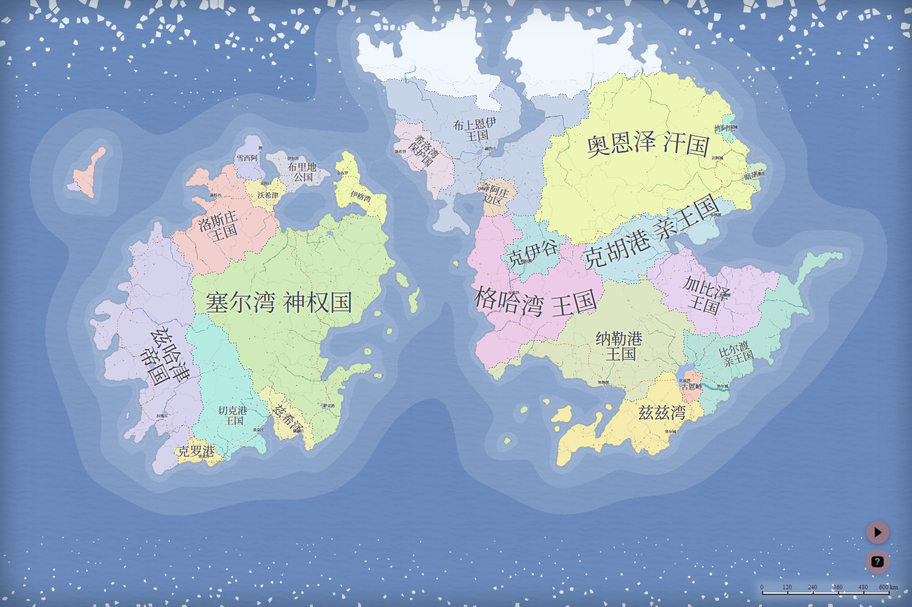

# Fantasy Map Generator 中文增强版

这是 [Azgaar's Fantasy Map Generator](https://github.com/Azgaar/Fantasy-Map-Generator) 的中文本地化增强分支。原项目是一个免费的开源奇幻地图生成器，适合世界观创作者、跑团主持人、小说作者、游戏策划和地图爱好者用来生成、编辑和导出奇幻世界地图。

本分支的目标不是重做 Fantasy Map Generator，而是让中文读者可以更顺手地使用它：打开就是中文界面，地图上的国家、城镇、路线、政体、地理和军事术语尽量符合中文语境，同时保留原项目完整的生成、编辑和导出能力。



## 致谢原项目

本项目基于 Azgaar 开发和维护的开源项目：

- 原项目仓库：[Azgaar/Fantasy-Map-Generator](https://github.com/Azgaar/Fantasy-Map-Generator)
- 原版在线应用：[azgaar.github.io/Fantasy-Map-Generator](https://azgaar.github.io/Fantasy-Map-Generator)
- 原项目 Wiki：[Fantasy Map Generator Wiki](https://github.com/Azgaar/Fantasy-Map-Generator/wiki)

感谢 Azgaar 和社区长期维护这个强大的地图生成器。本分支保留原项目的 MIT License，所有核心生成能力、地图编辑能力和大量原始资源均来自上游项目。

## 本分支做了什么

当前中文化工作主要覆盖这些方向：

- **中文界面**：菜单、按钮、工具提示、弹窗、编辑器、导出和保存流程等 UI 文案已接入简体中文运行时字典。
- **中文地图视觉**：地图上的国家、城镇、路线、湖泊、河流、宗教和悬停提示会在中文模式下自动转写或翻译，减少英文专名混杂。
- **世界观资料管理**：工具菜单提供“世界观”管理器，可批量查看和填写国家、城镇、文化、宗教的状态、标签、概要、历史、人物、经济、教义等资料，并随地图文件保存。
- **术语统一**：为地理、气候、政体、宗教、军事、纹章等领域维护术语表，尽量避免同一个概念在不同面板里有多种译法。
- **动态文本处理**：人口、外交关系、文化分布、地图悬停说明和常用编辑窗口中的运行时文本通过模板翻译，不再依赖固定样例。
- **翻译流水线**：提供抽取、校验、回填流程，方便继续批量补全未翻译文本。
- **中文启动器**：提供双击启动入口，方便不熟悉前端命令的用户本地预览中文地图。

## 翻译原则

这个分支不追求机械替换英文，而是尽量让奇幻地图读起来像中文世界设定资料。我们的目标可以概括为“信、达、雅”：

- **信**：保留原项目的生成逻辑和世界观信息，不擅自改变地形、国家、文化、宗教、路线和城镇的含义。
- **达**：界面按钮、编辑器字段和悬停说明优先清楚好用，让读者知道自己正在看什么、能做什么。
- **雅**：地图上的名称尽量有中文地名感，避免大段生硬音译堆在一起。

随机生成名称是本项目最难也最有趣的部分。上游会把大量词根、后缀和专名动态组合出来，所以本分支采用“意译优先、音译兜底、短名可读”的策略：

| 原始语义或名称 | 中文处理示例 |
|---|---|
| `Dragon passage` | 龙隘道 |
| `Dusk trail` | 黄昏小径 |
| `Flame road` | 烈焰大道 |
| `Golden sea route` | 黄金航路 |
| `The Breezy Falcon passage` | 清风猎鹰隘道 |
| `The Echoing Imperial lane` | 回响帝国水道 |
| `Blackwatch` | 黑哨 |
| `Amberglen` | 琥珀谷 |
| `Civonavan` | 希沃城 |

当名称里有清晰词根时，会优先拆解含义并组合成中文地名，例如 `Golden sea route` 不写成一长串音译，而是处理成“黄金航路”。当名称只是随机音节、没有稳定语义时，会使用短音译并加上“城、港、堡、谷、津、湾”等中文地名后缀，避免出现过长、拗口、难记的纯音译。

少量特别重要或自动规则处理不够自然的名称，会进入 `public/i18n/locales/zh-CN/names.json` 做人工润色。这个文件相当于专名校订表，会优先于自动翻译规则生效。

## 快速启动

推荐方式：双击仓库根目录下的 `start-map.cmd`。

它会启动本地开发服务器，并打开中文页面：

```text
http://localhost:5173/Fantasy-Map-Generator/?locale=zh-CN
```

也可以用命令启动：

```bash
npm install
npm run dev:zh
```

如果只想启动原始开发服务器：

```bash
npm run dev
```

## 切换语言

中文模式地址带有：

```text
?locale=zh-CN
```

去掉这个参数，或改成 `?locale=en`，即可回到英文原版界面。页面右下角也有语言切换按钮。

## 翻译工作流

翻译中转目录在 `i18n-translation/`。常用命令：

| 任务 | 命令 |
|---|---|
| 抽取待翻译文本 | `npm run i18n:extract` |
| 校验回收译文 | `npm run i18n:validate` |
| 回填译文到应用 | `npm run i18n:merge` |
| 同步术语表 | `npm run i18n:terms` |

更详细的翻译规则、术语要求和 AI 批量翻译提示词见：

- `i18n-translation/README.md`
- `i18n-translation/TRANSLATION_GUIDE.md`
- `i18n-translation/termbase.json`

## 当前状态

这个分支仍在持续打磨中。主要界面、首屏地图、常用悬停说明，以及城镇、路线、湖泊、河流等常见编辑窗口已经可以中文使用。仍可能看到：

- 少量英文品牌名、文件格式名或链接名，这些通常会保留原文；
- 很深层的编辑器、第三方资源说明或旧样例文本仍待补译；
- 随机生成的奇幻专名仍可能偶尔不够自然，需要继续扩充词根和人工校订表。

欢迎继续反馈具体页面、按钮、弹窗或地图标签中的不自然译法。最好附上截图、原文或复现步骤。

## 面向开发者

本项目仍沿用上游架构，正在从 vanilla JavaScript 逐步迁移到 TypeScript。当前代码大体分为：

- world data / styles：地图数据和样式状态；
- generators：程序化世界生成；
- editors / controllers：交互式编辑器；
- renderers：SVG、WebGL 等视觉渲染。

中文化逻辑主要集中在：

- `public/i18n/i18n.js`
- `public/i18n/locales/zh-CN/`
- `i18n-translation/`
- `scripts/i18n-*.mjs`

## License

本分支继承原项目的 MIT License。请同时尊重并保留原项目作者与社区的署名、许可证和相关链接。
